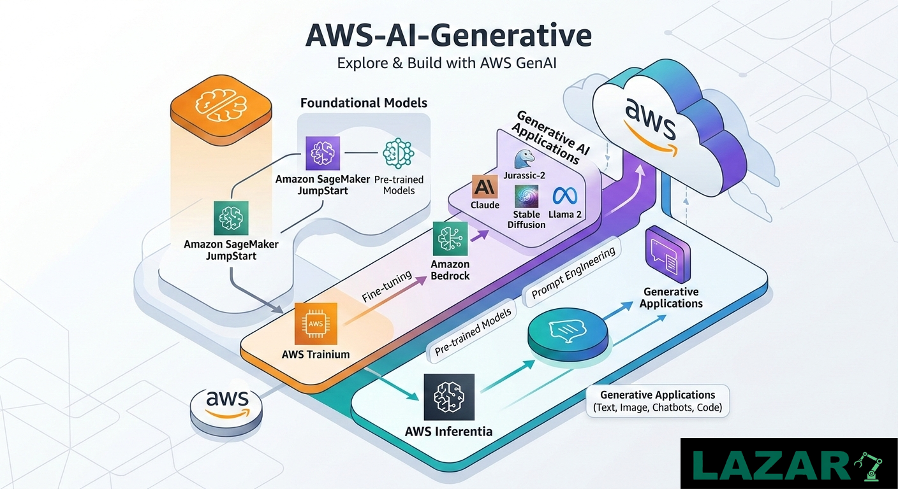

# AWS AI Generative



## 📌 Overview

This repository contains **simple and practical examples of Generative AI on AWS**
using **Amazon Bedrock**.

It is designed for:
- Learning and experimentation
- Demos and workshops
- Proofs of concept (PoCs)

The repository keeps everything **minimal, readable, and easy to extend**, focusing on
core Generative AI patterns such as chatbots and Retrieval-Augmented Generation (RAG).

---

## 🧠 Generative AI on AWS

**Generative AI** enables applications to generate new content such as text,
summaries, and conversational responses.

AWS provides managed services to build Generative AI solutions securely and at scale,
including:

- **Amazon Bedrock** – Serverless access to foundation models
- **Amazon SageMaker** – ML experimentation and training
- **AWS Lambda & API Gateway** – Serverless APIs
- **Amazon S3** – Document storage
- **AWS IAM & KMS** – Security and encryption

This repository focuses primarily on **Amazon Bedrock**.

---

## 🏗️ Reference Architecture

A typical Generative AI flow on AWS includes:

1. User input (CLI / Notebook / Application)
2. Prompt orchestration
3. Optional context injection (RAG)
4. Model inference via Amazon Bedrock
5. Response generation
6. Security, monitoring, and governance

---

## 📂 Repository Structure

```text
.
├── examples/          # Simple Generative AI examples
│   ├── chatbot/       # Amazon Bedrock chatbot
│   └── rag/           # Basic RAG implementation
│
├── notebooks/         # Jupyter notebooks for experimentation
│
├── prompts/           # Reusable prompt templates
│
├── scripts/           # Helper scripts (setup, validation)
│
├── docs/              # Lightweight documentation
│
├── .gitignore
├── LICENSE
└── README.md


👉 [Become a Sponsor](https://github.com/sponsors/Lazaro549)

