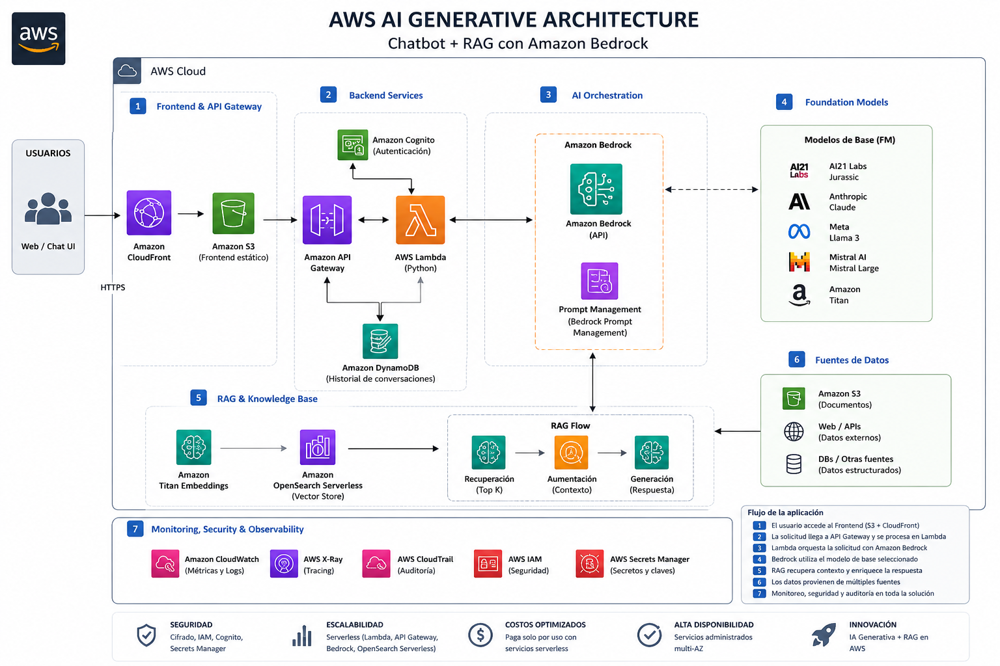

# AWS AI Generative


Simple and practical examples of Generative AI on AWS using Amazon Bedrock —
from a minimal chatbot and a from-scratch RAG pipeline to a serverless Lambda
API and a production-quality evaluation framework for measuring RAG quality
objectively.

## 📁 Repository structure

```
AWS-AI-Generative/
├── examples/
│   ├── chatbot/        # Minimal Bedrock chatbot (app.py)
│   └── rag/             # Retrieval-Augmented Generation without a vector DB
├── evaluation/           # Objective evaluation framework for the RAG example
│   ├── metrics.py        # Context precision/recall, faithfulness, relevancy...
│   ├── evaluate_retrieval.py
│   ├── evaluate_generation.py
│   ├── dataset/          # Evaluation question/answer dataset
│   └── reports/          # Generated JSON evaluation reports (git-ignored)
├── src/lambda/            # AWS Lambda handler exposing Bedrock via an API
├── infrastructure/        # AWS SAM template (serverless deployment)
├── notebooks/              # Jupyter notebooks: text generation, chatbot
├── prompts/                 # Reusable prompt templates
├── scripts/                  # Setup / validation helper scripts
├── docs/                      # Getting started + best practices guides
├── tests/                      # Unit + integration tests (pytest)
└── certifications/               # Supporting AWS AI certification materials
```

## 🚀 Getting started

### Prerequisites
- Python 3.10+
- An AWS account with access to [Amazon Bedrock](https://aws.amazon.com/bedrock/)
- AWS credentials configured locally (`aws configure`, `~/.aws/credentials`, or `AWS_PROFILE`)

### Install

```bash
git clone https://github.com/Lazaro549/AWS-AI-Generative.git
cd AWS-AI-Generative
pip install -e ".[dev]"
cp .env.example .env   # then fill in your own values
```

### Run an example

```bash
python examples/chatbot/app.py
python examples/rag/query.py
```

Each example also falls back to its own `config.json` when an environment
variable isn't set — see [`docs/getting-started.md`](docs/getting-started.md).

## 🧪 Tests

```bash
pytest -v
```

The suite covers the chatbot, the RAG pipeline, the Lambda handler,
environment configuration, and the evaluation framework — all AWS calls are
mocked, so no credentials are required to run it.

## 📊 Evaluation framework

[`evaluation/`](evaluation/) is an independent, objective evaluation
framework for the RAG example: context precision, context recall,
faithfulness, answer relevancy, retrieval and end-to-end latency, and cost
per query. See [`evaluation/README.md`](evaluation/README.md) for
methodology, dataset format, and how to run it.

```bash
python evaluation/evaluate_retrieval.py    # no AWS access needed
python evaluation/evaluate_generation.py   # needs Bedrock access
```

## ☁️ Deployment

[`infrastructure/template.yaml`](infrastructure/template.yaml) is an AWS SAM
template that deploys the Lambda handler as a serverless API backed by
Bedrock. The `deploy` workflow in
[`.github/workflows/deploy.yml`](.github/workflows/deploy.yml) builds and
deploys it on every push to `main`, after the test suite passes.

## 📄 License

[MIT](LICENSE)
